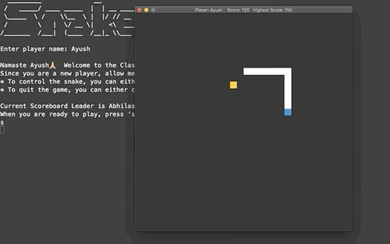

# Snake 2D_Game

This is my [Udacity C++ Nanodegree] Capstone Project.

In this project I have extendend the [Snake-Game](https://github.com/udacity/CppND-Capstone-Snake-Game) by adding my own custom game features using the principles and techniques I learned in this Nanodegree.



## Dependencies for Running Locally
* cmake >= 3.11.3
  * All OSes: [click here for installation instructions](https://cmake.org/install/)
* make >= 4.1 (Linux, Mac), 3.81 (Windows)
  * Linux: make is installed by default on most Linux distros
  * Mac: [install Xcode command line tools to get make](https://developer.apple.com/xcode/features/)
  * Windows: [Click here for installation instructions](http://gnuwin32.sourceforge.net/packages/make.htm)
* gcc/g++ >= 7.4.0
  * Linux: gcc / g++ is installed by default on most Linux distros
  * Mac: same instructions as make - [install Xcode command line tools](https://developer.apple.com/xcode/features/)
  * Windows: recommend using [MinGW](http://www.mingw.org/)
* SDL2 >= 2.0
  * All installation instructions can be found [here](https://wiki.libsdl.org/Installation)
  * Note that for Linux, an `apt` or `apt-get` installation is preferred to building from source. 
  * Additionally, there are detailed instructions in the LazyFoo SDL tutorial page [here](https://lazyfoo.net/tutorials/SDL/01_hello_SDL/index.php)
  * Below are the steps I followed to install the SDL2 in my machine.
    - Downloaded the source code from [here](http://www.libsdl.org/release/SDL2-2.0.12.tar.gz)
    - Extracted the SDL2-2.0.12 folder from the downloaded tar.gz file.
    - Executed following commands to build and install SDL2 in my system.
    ```
    cd SDL2-2.0.12
    ./configure
    make all
    sudo make install
    ```
* SDL2 Mixer >= 2.0
  * All installation instructions can be found [here](https://www.libsdl.org/projects/SDL_mixer)
  * SDL2 Mixer requires SDL2-2.0.12 to be already installed in the system.
  * Below are the steps I followed to install the SDL2 Mixer in my machine.
    - Downloaded the source code from [here](https://www.libsdl.org/projects/SDL_mixer/release/SDL2_mixer-2.0.4.tar.gz)
    - Extracted the SDL2_mixer-2.0.4 folder from the downloaded tar.gz file.
    - Executed following commands to build and install SDL2 Mixer in my system.
    ```
    cd SDL2_mixer-2.0.4
    ./configure
    make all
    sudo make install
    ```


## Basic Build Instructions

1. Clone this repo.
2. `cd` into Snake-Game directory and make a build directory: `mkdir build && cd build`
3. Compile: `cmake .. && make`
4. Run it: `./SnakeGame`.


## Expected behaviour when you run the game

- On launch, an ASCII art depicting the name of the game - SNAKE, will be displayed on the terminal.
- The player will be prompted to enter his/her name.
- If the person is a new player, he/she will be introduced to the game controls and the current leader 
  of the scoreboard.
- If the person has already played this game before, the player will be shown his/her previous score and 
  the current leader of the scoreboard.
- If the person happens to be a new player but the chosen name is already taken, the player will be allowed 
  to choose a different name by pressing the 'c' key and then the enter key.
- When the person press the 's' key and hit enter, the game will start by opening a new game window.
- The above listed leaderboard features will only be available if the scoreboard.txt file is present in the
  assets folder. When you clone this project, you will get a scoreboard.txt file with an entry already present.
- If this scoreboard.txt file is tampered with, for instance if the file gets deleted or is empty or contain 
  invalid entries, then the game will automatically disable the leaderboard feature during the loading process.
- The game has a retro-style block graphics. The game will run with 60 FPS. The duration of each frame is controlled
  to give a consistent user experience irrespective of hardware.
- The window title will show the player name, current score and the highest score (if the leaderboard feature 
  is not disabled by the game while loading).
- Food will appear in a randomly-generated space. 
- The goal is to direct the snake to the food, which the snake will eat when it hits the correct square.
- The snake can be controlled using arrow keys as well as using the 'w','a','s','d' keys.
- If no key is pressed, the snake will continue in the same direction. 
- When the snake eats food, the snake's length will increases by 1 square, its speed will increase slightly
  and the player's score will increase by 10 points.
- You can quit the game in the middle of the play by pressing 'q' key or by closing the game window.
- When the snake eats food a biting sound effect will be produced.
- When the snake head ends up hitting its own body, the snake dies and the game will be over.
- A 'dud' sound effect will be produced when the snake eats itself.
- If the snake is dead, the game window will close and the results will be displayed on the terminal.
- The result will always contain the player name and the score. 
- If the leaderboard feature was not disabled by the game in the beginning, the results will also show
  the scoreboard.
- Each entry of the scoreboard will contain a player name and his/her score.
- If the player score has crossed the previous highest score, a congratulations message will also be displayed.


## Basic file and class structure

All source code is in `src/` path. There is a `main.cpp` which calls the game loop and a series of classes each having a `.h` and a `.cpp` file. These classes are

1. Game       - The abstraction for generically running a game. Defines the game loop and scoring mechanism. Acts as the central infrastructure, orchestrating the control flow between the user input, the visualisation, the filesystem and the game mechanics.
2. Controller - A handler for user input. Uses SDL2 in its implementation.
3. Renderer   - A handler for visualisation and sound effects. Uses SDL2 and SDL2 Mixer in its implementation.
4. Snake      - The object the user controls within the game. Has methods to move and actions to perform when it eats food.

The scoreboard.txt file and the sound effect files are present in the `assets/` path.


## How to contribute to this project

Contributions are what make the open source community such an amazing place to learn, inspire, and create.
Any contributions you make are greatly appreciated.

1. Fork the Project
2. If you wish to add a new feature, create a feature branch (`git checkout -b feature/AmazingFeature`)
3. Commit your changes (`git commit -m 'feat: Add some AmazingFeature'`)
4. Push your branch to the remote repo (`git push origin feature/AmazingFeature`)
5. Open a Pull Request
6. If you found a bug, create a bugfix branch (`git checkout -b bugfix/bug`)
7. Commit your changes (`git commit -m 'fix: Add your fix'`)
8. Push your branch to the remote rep (`git push origin bugfix/bug`)
9. Open a Pull Request

I followed Udacity Git Commit Message Style [Guide](https://udacity.github.io/git-styleguide/).
Please follow the same guidelines when you make your commits. 